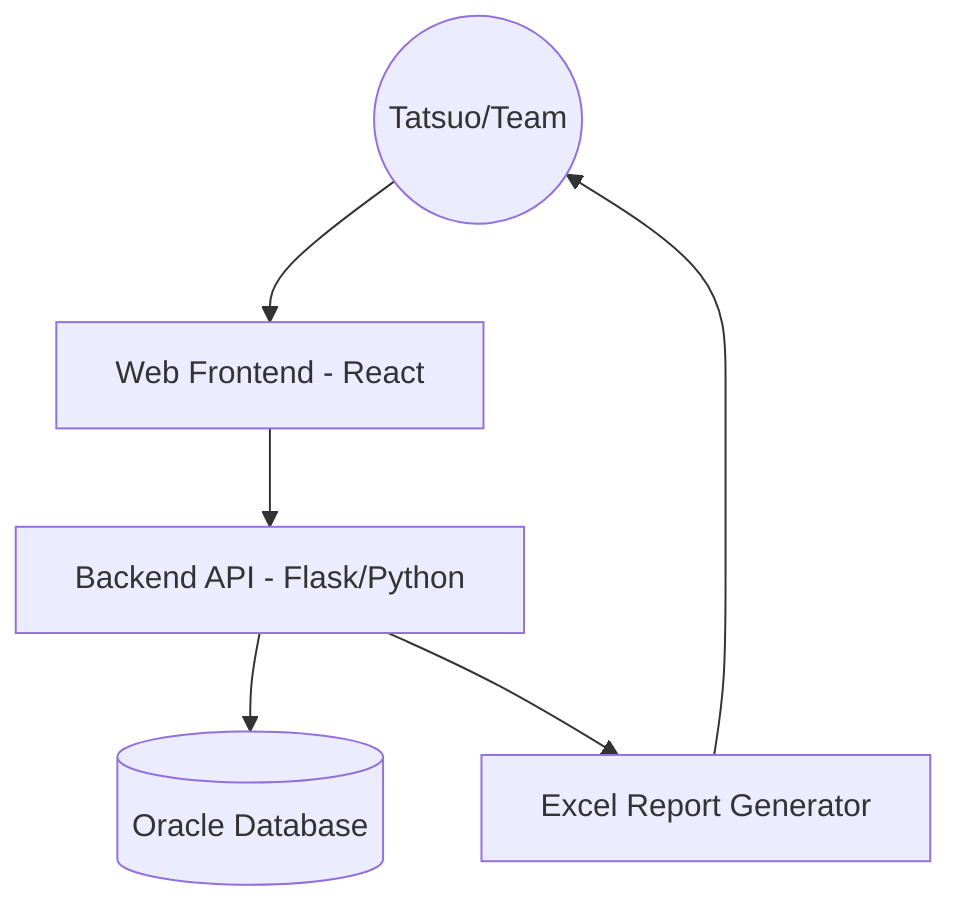

# Professional Development Roadmap: Web & Oracle Migration

> **Objective**: Transition the Excel-based reporting tool to an Enterprise-grade Web Application backed by an Oracle Database.

## Proposed Architecture

## Phase 1: Database Foundation
1.  **Schema Design**: Define the `IFS_TICKETS` table structure (Ticket No, Status, Category, PIC, etc.).
2.  **Migration Tool**: Build a one-time Python script to read `NA Daily work.xlsx` and insert all historical data into Oracle.
3.  **Upsert Logic**: Implement logic to handle data sync between Excel and DB if necessary.

## Phase 2: Backend API (Python)
1.  **Connectivity**: Install `oracledb` and set up secure credential management.
2.  **Logic Layer**: Migrate the "Backlog" and "Strict" filtering logic from `generate_report.py` into SQL queries.
3.  **Endpoints**:
    *   `GET /tickets`: Fetch tickets based on filters.
    *   `GET /stats`: Fetch weekly dashboard statistics.
    *   `POST /tickets`: Allow web-based ticket entry.

## Phase 3: Frontend & Reporting
1.  **Dashboard UI**: Create a clean, responsive page using Tailwind CSS.
2.  **Statistics Cards**: Display Open/Closed counts dynamically.
3.  **Export Engine**: Wire up the current `generate_report.py` logic to a "Download Excel" button on the web page.

## Verification Plan
*   **Data Integrity**: Verify counts in Oracle match the Excel source.
*   **Performance**: Compare report generation speed (DB vs Excel).
*   **User Experience**: Validate that the web form saves correctly to Oracle.
